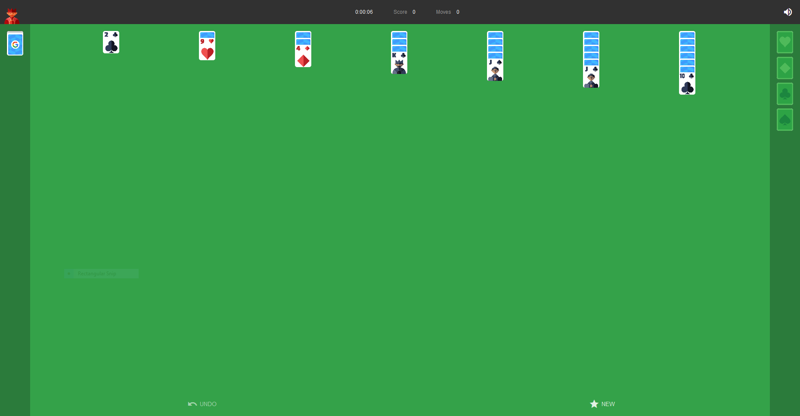

# Solitaire

 Google's Solitaire CURL'd and compiled into a playable format for offline use.

Play Offline

- download the repo as a [`.zip`](https://github.com/fluteds/google-solitaire/archive/refs/heads/main.zip)
- extract the `.zip` file using 7zip
- open `index.html` with any browser



The following source links were grabbed using `curl` and transformed into the working page you see now.

```url
https://www.google.com/logos/fnbx/solitaire/standalone.html
https://www.google.com/logos/fnbx/solitaire/solitaire_compiled.2.js
https://www.google.com/logos/fnbx/solitaire/default.css
https://www.google.com/logos/fnbx/solitaire/mobile_portrait.css
https://www.google.com/logos/fnbx/solitaire/ipad.css
https://www.google.com/logos/fnbx/solitaire/card-sprite.png
https://www.google.com/logos/fnbx/solitaire/ribbon_no_text.png
```

I do not own any of the assets used including the Google Logos or Trademarks.
